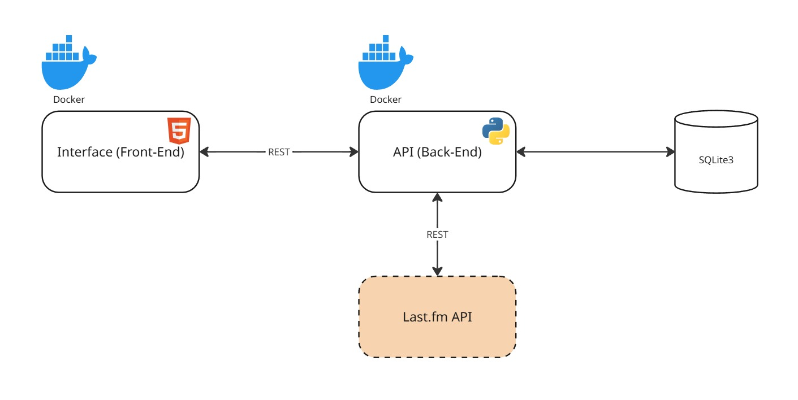

# tunefinder-front-end

## Descrição do Projeto

Este projeto consiste no desenvolvimento de uma aplicação front-end para recomendações de músicos, à partir dos gostos musicais do usuário.

A aplicação foi desenvolvida como parte do MVP do módulo de **Arquitetura de Software** do curso de **Pós-Graduação em Engenharia de Software da PUC-RIO**,  com o objetivo de aplicar conhecimentos em sistemas compostos e comunicação REST.

## Funcionalidades

- Controle de autenticação
- Busca de artistas em base externa (Last.fm)
- Cadastro de artistas favoritos (inclusão, exclusão e inclusão de anotações)
- Recomendação de artistas

---

## Estrutura do Projeto

```text
tunefinder-front-end/
├── index.html
├── styles.css
└── scripts.js    
```
---

## Requisitos

- Navegador moderno (ex.: Chrome, Edge, Firefox).
- Backend que exponha os endpoints esperados (consulte o [repositório do backend](https://github.com/andersonyama/tunefinder-back-end) correspondente para referência).

---

## Configuração

- Garantir que o backend esteja rodando e acessível.
- Garantir que a variável `API_BASE_URL` em [`index.html`](src/index.html) esteja apontando para o endereço que o backend esteja disponível.

## Inicialização através do Docker

Certifique-se de ter o [Docker](https://docs.docker.com/engine/install/) instalado e em execução em sua máquina.

Navegue até o diretório que contém o Dockerfile no terminal.
Execute **como administrador** o seguinte comando para construir a imagem Docker:

```
$ docker build -t tunefinder-front .
```

Uma vez criada a imagem, para executar o container basta executar, **como administrador**, o seguinte comando:

```
$ docker run -d -p 8080:80 tunefinder-front
```

Uma vez executando, para acessar a interface da aplicação, basta abrir o [http://localhost:8080](http://localhost:8080) no navegador.

## Inicialização da aplicação completa através do Docker-compose

Neste repositório está disponível um docker-compose para que a interface e a API sejam inicializadas em conjunto, sem necessidade de nenhuma configuração adicional.

Certifique-se de ter o [Docker](https://docs.docker.com/engine/install/) instalado e em execução em sua máquina.

Também se certifique de que o diretório do back-end e do front-end estejam no mesmo diretório.

Navegue até o diretório que contém o `docker-compose.yaml` no terminal.
Execute **como administrador** o seguinte comando para iniciar a aplicação:

```
$ docker-compose up --build
```

Uma vez executando, para acessar a API, basta abrir o endereço [http://localhost:5000](http://localhost:5000) no navegador, e para acessar a interface, basta abrir o endereço [http://localhost:8080](http://localhost:8080).

## Arquitetura da Aplicação

A aplicação completa é disponibilizada por esta interface HTML e uma API em Python, que faz a comunicação com o banco de dados em SQLite3 e a API externa [Last.fm](https://www.last.fm/api)



## Contexto Acadêmico

Projeto desenvolvido para fins acadêmicos no curso de Pós-Graduação em Engenharia de Software da PUC-RIO.


---
